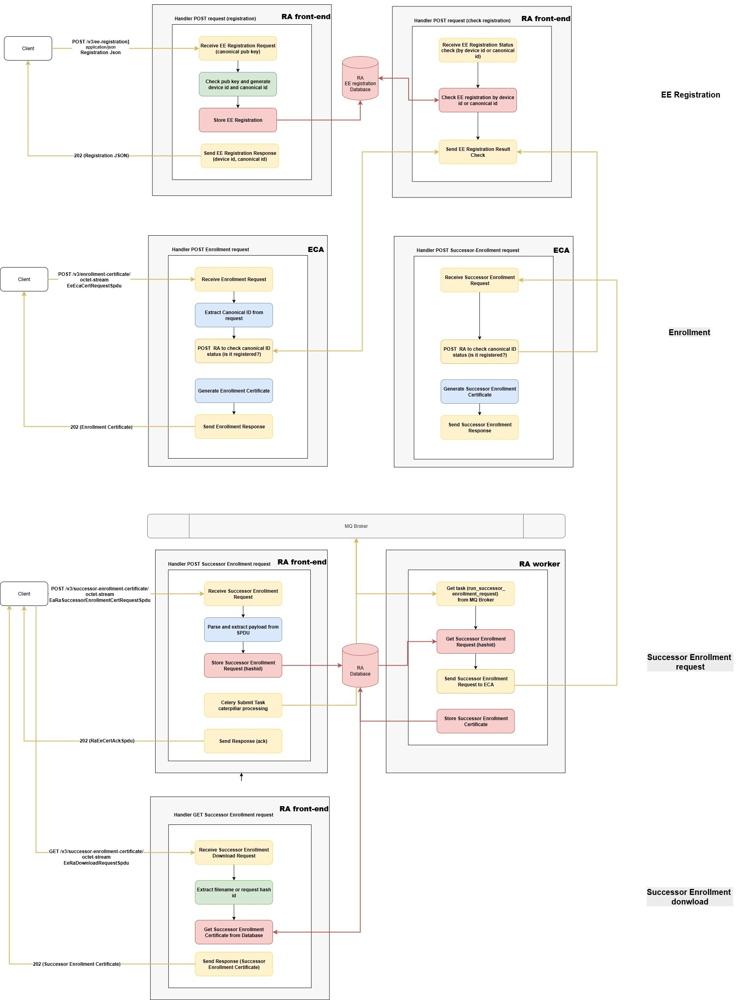
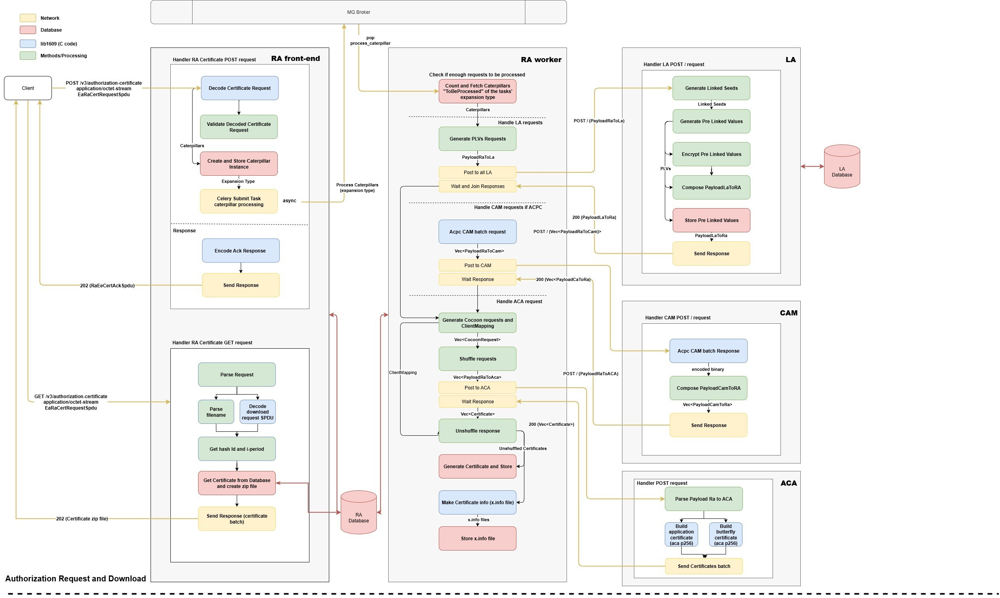

# About 

TODO

# OpenSCMS Architecture Overview

This document describes the architecture and execution flows of OpenSCMS focusing on four end‑to‑end journeys:
1) **Authorization Certificate — Request & Download**
2) **EE Registration**
3) **Enrollment Request**
4) **Successor Enrollment Request**

The goal is to clarify component responsibilities, and narrate how data moves through the system.

## System Roles & Data Stores
- **Registration Authority (RA)** — EE registration, authorization-certificate request/ack/download, and successor enrollment orchestration. Stores state in **RA DB**.
- **Enrollment Certificate Authority (ECA)** — enrollment certificates and successor enrollment responses. Stores state in **ECA DB**.
- **Authorization Certificate Authority (ACA)** — authorization certificate issuance. Stores state in **ACA DB**.
- **Linkage Authority (LA)** — PLV/LS operations for linkage values. Stores state in **LA DB**.

Each component maintains its **own local database**.

---

## 1) EE Registration (Fully Synchronous)

The system registers an "EE" entity, and it must be the first interaction between the client and OpenSCMS. In this process, the client sends the public key it requests to use as canonical information. Based on this public key (which will be stored in the RA database), the server generates a canonical ID and device ID for this client, registering it in the system. It is important to note that this table, dedicated to storing the EE registered in the system, is consulted during each interaction between OpenSCMS and EE to check the EE's status and condition.

**Public API (RA):**
- `POST /dcms/device/na` — **200 JSON** with **canonicalId**, **deviceId**, **device policy**.
- `GET  /dcms/device/na` — **200 JSON** lookup by canonicalId/deviceId.
- `PATCH /dcms/device/na` — **200** to update device status.

### Components
- Registration request parsing.
- State creation/persistence for the EE entity. It basically creates the canonical id and device id based on the public key sent by client.
- Registration acknowledgment/response.

### Data Flow
1. The **client** sends an **EE registration request**.
2. RA creates **canonicalId** and **deviceId**, stores the client public key in **RA DB**, and returns success **synchronously** including the generated identifiers and policy file.
3. The server **responds** to the client with registration status/acknowledgment.

---

## 2) Enrollment Request

The client initiates an enrollment process. The server handles request decoding, initially capturing the applicant's canonical ID so that identity can be verified. It's worth noting that step 1) of EE registering is crucial, as it allows the canonical ID to identify the identity of the EE attempting to enroll. Based on the canonical ID provided in the enrollment request, the ECA can verify the message signature and proceed with creating the certificate. The certificate is created and forwarded to the client. This process is completely synchronous.

**Public API (ECA):**
- `POST /v3/enrollment-certificate` → **202 EcaEeCertResponseSpdu** (binary C‑OER).

### Components (as shown)
- Enrollment request decoding.
- Work item creation/storage.
- Background processing (e.g., Celery workers).
- Enrollment response/acknowledgment.

### Data Flow (narrative)
1. The **client** sends an **enrollment request** (EeEcaCertRequestSpdu).
2. The server **decodes** the request and **creates/persists** an enrollment work item.
3. ECA processes enrollment certificate crafting.
3. The server **responds** **202** with **EcaEeCertResponseSpdu**.

---

## 3) Successor Enrollment Request and Download

Handles successor enrollment for an already‑registered entity. This process is asynchronous and goes through the RA. The RA receives the successor enrollment request, decodes it, and sends the ack to the client. The RA creates a working task and places it in the Celery task queue. An RA worker instance retrieves this task and then executes the process of creating the successor enrollment certificate, which essentially consists of forwarding this request to the ECA, which will produce the certificate. The ECA responds with the created certificate, and the RA worker saves the certificate in the database using the request ID as the key. The client, through the ack, is informed of the download time, and thus, upon submitting the download request, it will receive the generated certificates—the RA searches the database based on the request ID.

**Public APIs:**
- **RA** `POST /v3/successor-enrollment-certificate` — **202 RaEeEnrollmentCertAckSpdu**.
- **RA** `GET  /v3/successor-enrollment-certificate` — **202 C‑OER EcaEeCertResponseSpdu** (download).
- **ECA** `POST successor-enrollment-certificate` (RA to ECA) → **202 C‑OER EcaEeCertResponseSpdu**.

### Components
- Successor enrollment request decoding.
- Work/state creation.
- Background processing (e.g., via Celery).
- Response/acknowledgment.

### Data Flow
1. Client calls **RA POST** with **EaRaSuccessorEnrollmentCertRequestSpdu**.
2. RA coordinates processing and returns **202 Ack**.
3. RA front-end creates a celery task for assyncronous processing.
3. RA worker takes the task and requests the successor enrollment from ECA; artifacts are persisted.
4. Client later calls **RA GET** to download the **C‑OER EcaEeCertResponseSpdu**.

---

## 4) Authorization Certificate — Request & Download (Async with Ack + Download)

A client asks the server to create authorization certificates. The server immediately acknowledges and performs the work asynchronously. Later, the client requests a download, and the server returns the generated certificates.
This is the main flow of OpenSCMS and follows the design of building asynchronous interaction between components. Upon receiving the request, the RA decodes it to extract information about the EE's identity. With this information, it can check in the registration table whether the EE is registered and enrolled. Based on this, the request's signature is verified based on the EE's enrollment certificate. Once this is done, the request is constructed, and a Celery task is published to the queue. The RA responds with an ACK to the client informing the download time. Asynchronously, an RA worker retrieves the task from the queue to process the creation of the certificates. This process involves the interaction between the ACA and LA components (to create the linked values). The ACA is responsible for generating the batch of certificates based on the requested i-period and the certificate type (non-butterfly or butterfly flavor). The certificates are returned to the RA worker, which will save them in the database to be retrieved later. The client sends the download request, and based on the request ID, the generated certificates are retrieved from the database and returned to the client. 

**Public API (RA):**
- `POST /v3/authorization-certificate` — **202 RaEeCertAckSpdu** Ack has the download time.
- `GET  /v3/authorization-certificate` — **200 binary (zip)** Zip wrapping all certificates generate.

### Components
- **Decode Certificate Request** — Parses the incoming certificate request SPDU using the lib1609 codecs, extracting the request info and the identity of the EE (canonical ID).
- **Create and Store Caterpillar Instance** — Creates a work item (a task, composed by a "Caterpillar" instance) and persists it.
- **Celery Submit Task** — Submits the new work item to background workers for processing.
- **Encode Ack Response** — Produces a the RaEeCertAckSpdu - It has the download time.
- **Send Response** — Sends the acknowledgment to the client.
- **Workers (Celery)** — RA workers are responsible for process the work item and create the authorization certificates based on the interaction between RA and ACA (who will actually perform the certificate crafting)
- **Download Request / Download Response** — The client asks to download the results; the server returns the generated certificates based on request ID

### Data Flow
1. Client submits **EaRaCertRequestSpdu** to RA.
2. RA decodes and persists work (Caterpillar) and places a task for background processing.
3. RA replies **202** with **RaEeCertAckSpdu**.
4. Workers complete certificate generation (via ACA/LA as configured) and persist artifacts (certifciates based on the request hash).
5. Client requests **Download**; RA returns the packaged certificates (**200**, binary zip).

# Assumptions and Limitations

## SCMS API Available Endpoints
OpenSCMS implements the endpoints described in the IEEE 1609.2.1 (2022) standard. The endpoints are listed below and organized per SCMS component along with the reference to the respective Table in 1609.2.1 (2022) document:
- RA  
    - Authorization Certificate Request - Table 10
        - Can issue both pseudonym and identification/application certificates for EEs
    - Authorization certificate download - Tables 11, 12 and 14
    - Successor Enrollment certificate request - Table 13
    - CCF including CTL Download - Table 16
    - Composite CRL including CTL download - Table 17
    - Individual CA certificate Download - Table 18
    - Individual CRL Download - Table 19 
        - Note that a CRL download endpoint is available although OpenSCMS does not currently implement the MA component for misbehavior reports
    - CTL download - Table 20
    - RA certificate download - Table 21
    - Certificate management information status download - Table 23
- ECA  
    - Enrollment cert request - Table 9  

RA Limitations. The "MA certificate download" (Table 22) and the "Misbehavior report submission" (Table 15) endpoints are not implemented by the RA as OpenSCMS currently does not implement a Misbehavior Authority component (see more at [Misbehaviour and Linkage Authorities](#misbehaviour-and-Linkage-Authorities)).

## Types of issued certificates
A running instance of OpenSCMS (differently from other existing proprietary SCMS solutions) can support multiple types of End Entities (EEs) or certificates requests simultaneously, i.e.,
- OBU clients can request pseudonmym or identification certificates, and  
- RSU clients can request identification certificates.  
A single OpenSCMS running instance supports provision of all options above.

EE clients can request either implicit or explicit pseudonym certificates. Implicit relies on the ECQV keys, which reduces space (saving 64 bytes per certificate), while explicit certificates rely on standard ECDSA over P256 keys and signatures.
Both EE and CA certificates are assumed to be 1609.2 format (not X.509).

## ASN1 1609.2 version
OpenSCMS currently supports the IEEE 1609.2.1 ASN.1 files with tag [2022-published](https://forge.etsi.org/rep/ITS/asn1/ieee1609.2.1/-/tree/2022-published?ref_type=tags). OpenSCMS provides transpiling utilities (via a fork of the ASN1C transpiler) to convert the IEEE 1609.2.1 ASN1.C files into C code. If new official ASN.1 files are published in the future, the utilities can be used for the migration.

## Policy files
OpenSCMS policies and policy files follow closely the SaesolTech SCMS' policies, where SaesolTech SCMS is one of the the eligible Omniair Consourtium SCMSs to certify clients under 1609.2.1.
Limitation. No current per-region policy files. Support for multiple regions on policy files may be a future feature. 

## Bootstrapping Server Certificates 
For testing purposes OpenSCMS provides a script that generates sample elector certificates, a sample CA certificate chain, and a CTL signed by those elector certificates. 
The certificates generated and stored in COER format at a filesystem folder, which should be accessible by the SCMS components for database loading, like the ECA, ACA, RA.
Each OpenSCMS instance should generate its own set of CA certificates during bootstrapping. 
Limitations. Currently no MA or LA certificates are generated as the SCMS does not implement those components.

## Issuing CTLs and electors assumptions
SCMS Certificate Trust Lists (CTLs) need to be typically signed by a quorum of multiple electors.  
Electors are independent entities that “notarize” SCMS Manager decisions. They do not do any validation of the actual CTLs.
The SCMS Manager [SCMS Manager](www.scmsmanager.org) is a consortium of stakeholders dedicated to the reliable and sustained operation of the V2X ecosystem. Members consist of automotive OEMs, roadside infrastructure, and traffic management systems, and government agencies.  
Both the electors and the SCMS Manager are independent entities from the OpenSCMS. The SCMS Manager [SCMS Manager](www.scmsmanager.org) for instance provides electors certificates and related services under membership subscription. 
In order to generate a CTL, an OpenSCMS instance would generate its core CTL payload and submit it to the SCMS manager service to get it signed by the electors.  
Currently OpenSCMS is not integrated with [SCMS Manager](www.scmsmanager.org).
The current CTL bootstrapping process generates sample electors who sign the CTL via a bootstrapping script described in [Bootstrapping Server Certificates](#bootstrapping-server-certificates).
Note also that the EEs aiming to enroll with an openSCMS instance should have available the initial electors certificate information in order to be able to validate the CTLs. Whether this information is provided to the EEs in manufacturing or boostrapping time or how is out of scope.
   

## Misbehaviour and Linkage Authorities
The current openSCMS does not handle misbehaviour mechanisms for potential EE certificate revocation as there is no well established related standard in North America.  
While in Europe the [ETSI TS 103 759](https://www.etsi.org/deliver/etsi_ts/103700_103799/103759/02.01.01_60/ts_103759v020101p.pdf) standard defines an interoperable data structure and protocol (using ASN.1) for a vehicle to prepare and send misbehavior reports to a Misbehaviour Authority, the North American standards assume the function exists within the system design (the SCMS), but the precise, universally standardized "message type" for sending the raw evidence from the field is less explicitly defined as a dedicated, formal standard in the public domain compared to the European system. 
Misbehaviour support is a future desired feature, and ideally it should be as much interoperable as possible (potentially allowing for North America, European and other standards).

<!-- ### Code assumptions
[TODO]: this should go to the respective C projects 
- On the C implementation we have a set of assumptions. 
    - POSIX-2024 compliant pointer array initialization:  
        We initiallize pointer arrays with memset of 0's in the whole array. This guarantees compatibility with only modern architectures where the null pointer representation is all bit zeros.  
        For example, the sample code below should succeed in the targeted architectures.  
            int *pointer_array[10];  
            memset(pointer_array, 0, sizeof(pointer_array));  
            for (size_t i = 0; i < 10; ++i) assert(pointer_array[i] == NULL);  

    [TODO] List more code assumptions: RUST? C? -->

## Copyright and License Information

Unless otherwise specified, all content, including all source code files and
documentation files in this repository are:

Copyright (c) 2025 LG Electronics, Inc.

Licensed under the Apache License, Version 2.0 (the "License");
you may not use this file except in compliance with the License.
You may obtain a copy of the License at

<http://www.apache.org/licenses/LICENSE-2.0>

Unless required by applicable law or agreed to in writing, software
distributed under the License is distributed on an "AS IS" BASIS,
WITHOUT WARRANTIES OR CONDITIONS OF ANY KIND, either express or implied.
See the License for the specific language governing permissions and
limitations under the License.

SPDX-License-Identifier: Apache-2.0
